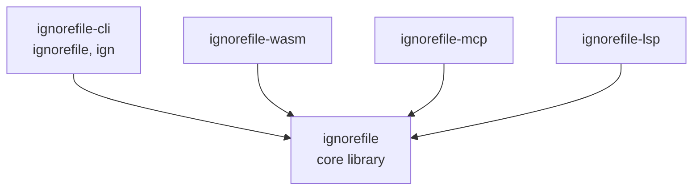
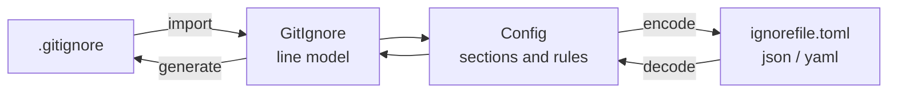

<!--
SPDX-FileCopyrightText: ignorefile contributors

SPDX-License-Identifier: MIT OR Apache-2.0
-->

# ignorefile

Manage `.gitignore` as structured, reviewable configuration instead of a
hand-edited flat file.

[](https://github.com/elioseverojunior/ignorefile/actions/workflows/ci.yml)
[](https://github.com/elioseverojunior/ignorefile/actions/workflows/mise.yml)
[](https://github.com/elioseverojunior/ignorefile/actions/workflows/codeql.yml)

[](https://scorecard.dev/viewer/?uri=github.com/elioseverojunior/ignorefile)
[](https://github.com/elioseverojunior/ignorefile/actions/workflows/scorecards.yml)
[](#license)
[](rust-toolchain.toml)

> **Status: pre-alpha.** All five surfaces work: import a `.gitignore`, keep it
> as TOML, JSON or YAML, generate it back, and reach it from the CLI, a browser,
> an MCP client or an editor. The format is not stable yet. See
> [docs/ROADMAP.md](docs/ROADMAP.md).

## Why

A `.gitignore` accumulates. Sections drift, rules get duplicated across repos, a
negation lands above the pattern it was meant to override, and nobody can tell
which of forty lines is still load-bearing. The file is append-only in practice
because editing it is risky.

`ignorefile` treats the ignore rules as data: import an existing
`.gitignore` into a structured config, review and compose that config like any
other source file, and generate the `.gitignore` back out.

## The idea

Import an existing file:

```gitignore
# Cargo
/target

## Mise
/mise.local.toml
!mise.lock

# Always Add
```

and get structured configuration back:

```toml
[[cargo]]
ignores = [
    "target"
]

[[Mise]]
ignores = [
    "/mise.local.toml"
]
add = [
    "mise.lock"
]

[["Always Add"]]
add = []
```

The shape above is the original sketch. What the tool writes is an ordered array
of sections under the file they describe, with names as **values** rather than
table keys:

```toml
version = 1
name = "ignore-as-config"

[[gitignore.section]]
name = "Logs"
note = "Ignore Logs Pattern"

  [[gitignore.section.rule]]
  ignore = ["*.log"]

  [[gitignore.section.rule]]
  note = "keep the one we actually read"
  add = ["important.log"]
```

which renders to

```gitignore
### ignore-as-config

## Logs
# Ignore Logs Pattern
*.log

# keep the one we actually read
!important.log
```

`###` names the configuration, `##` names a section, `#` is a note. Every one of
those choices is forced by a measured constraint, not taste: `serde_json` sorts
object keys by default, so a section name in key position would be silently
alphabetized and rule order is semantic; patterns are stored verbatim so
`/target` never becomes `target`; `add` omits the leading `!` so one rule has one
spelling; and comments are fields because JSON has no comment syntax and the
three encodings must be interchangeable.
[docs/design/config-format.md](docs/design/config-format.md) records the
evidence.

**Import is lossless or it refuses.** Rather than quietly changing which files
git ignores, `import` re-renders the config it just built and compares it to the
source, reporting the first differing line if they disagree.

**Editors get a schema.** Point them at
[schema/ignorefile.schema.json](schema/ignorefile.schema.json); for a
YAML config, a `# yaml-language-server: $schema=...` comment on the first line
does it. A test holds the schema to the Rust types so it cannot drift.

`gitignore` is a table rather than an array so that a `[dockerignore]` sibling
can be added later without disturbing it. That is not implemented yet.

## Usage

```sh
# Import an existing .gitignore, or start an empty config if there is none.
ignorefile init

# Convert a .gitignore into a config (overwrites the config).
ignorefile import

# Add patterns to a section, creating it if needed.
ignorefile add --section Cargo /target /debug
ignorefile add --section Logs --allow --note "keep this one" important.log

# Write the .gitignore back out from the config.
ignorefile generate

# Check the config without writing anything.
ignorefile validate
```

Both paths are configurable, and the encoding follows the config's extension:

```sh
ignorefile import --config ignorefile.yaml --gitignore .gitignore
```

TOML, JSON and YAML (`.toml`, `.json`, `.yaml`, `.yml`) are interchangeable: a
config written in one can be read and re-emitted as another without loss.

## Install

Not yet published. Build from source:

```sh
git clone https://github.com/elioseverojunior/ignorefile
cd ignorefile
mise run setup          # provisions the pinned toolchain
mise run build --release
```

The binary lands at `target/release/ignorefile`. `mise run build:setup`
also copies it into `~/.local/bin/`.

Note that the local build sets `-C target-cpu=native`, so the resulting binary
is tuned to your machine and is not portable to other CPUs.

## Surfaces

One crate per surface, each with its own README:

| Crate | Role | Status |
| --- | --- | --- |
| [`ignorefile`](crates/ignorefile) | core library: parse, model, render, match | working |
| [`ignorefile-cli`](crates/ignorefile-cli) | the CLI; ships `ignorefile` and `ign` | working |
| [`ignorefile-wasm`](crates/ignorefile-wasm) | WebAssembly bindings for browser use | working |
| [`ignorefile-mcp`](crates/ignorefile-mcp) | MCP server, so agents can manage ignore rules | working |
| [`ignorefile-lsp`](crates/ignorefile-lsp) | Language Server for editor diagnostics | working |



All logic lives in the core library; every other crate is a thin surface over
it. That is a rule, not an accident: it is what lets one differential test
against `git check-ignore` cover the semantics for all of them.

## How it fits together



Import is lossless or it refuses: the config is re-rendered and compared against
the source before it is written.

## Development

Everything runs through [mise](https://mise.jdx.dev):

```sh
mise run setup      # install the pinned toolchain and tools
mise run doctor     # check what is installed, one row per tool
mise tasks          # the full task list
mise run ci:quick   # fast gate: fmt + clippy + tests + doctests
mise run pr:ready   # auto-format, then check everything
```

The project is test-driven, warnings are hard errors, and the coverage gate is
100%. [AGENTS.md](AGENTS.md) documents the conventions and the traps in the
build configuration; it is worth reading before your first change.
[docs/RUNBOOK.md](docs/RUNBOOK.md) covers the operational side: releasing,
running each surface, and what to do when a gate goes red.

## Contributing

Please read [CONTRIBUTING.md](CONTRIBUTING.md) first. In short: a pull request
is a long-term maintenance commitment, so what matters is that you understand
your change and can support it.

The project has a firm policy on AI-assisted contributions, including a hard
prohibition on AI-written pull requests, commit messages and reviewer replies.
The full text is in
[docs/guidelines/CONTRIBUTION.md](docs/guidelines/CONTRIBUTION.md).

## License

Dual-licensed under either of

- Apache License, Version 2.0 ([LICENSE-APACHE](LICENSE-APACHE))
- MIT license ([LICENSE-MIT](LICENSE-MIT))

at your option. The canonical texts live in [LICENSES/](LICENSES); the two files
above are symlinks into that directory, which keeps the repository compliant
with the [REUSE Specification](https://reuse.software) (`mise run comply`).

Unless you explicitly state otherwise, any contribution you intentionally submit
for inclusion in this work shall be dual-licensed as above, without any
additional terms or conditions.
