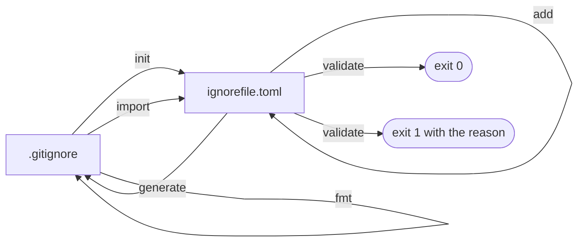
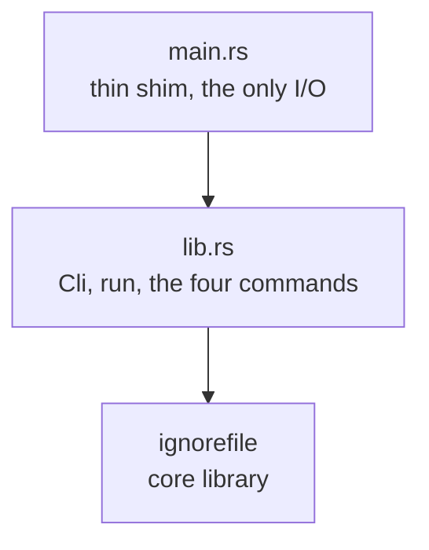
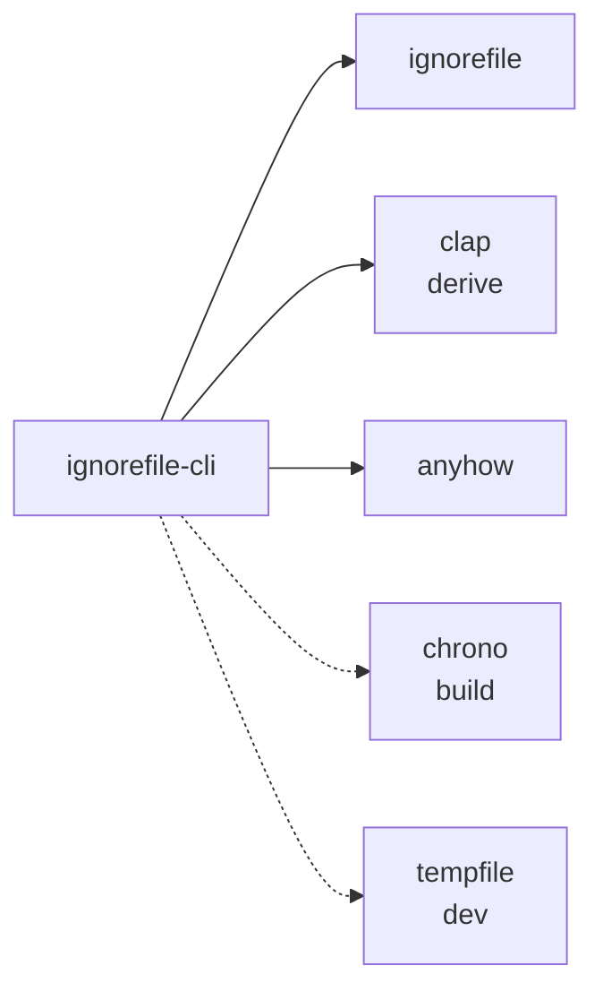

<!--
SPDX-FileCopyrightText: ignorefile contributors

SPDX-License-Identifier: MIT OR Apache-2.0
-->

# ignorefile-cli

The `ignorefile` command line interface. Ships two identical binaries,
`ignorefile` and the short alias `ign`.

Part of the [ignorefile workspace](../../README.md).

## Commands



| Command | Reads | Writes |
| --- | --- | --- |
| `init` | the `.gitignore` if present | the config, refusing to clobber without `--force` |
| `import` | the `.gitignore` | the config, overwriting |
| `add` | the config | the config, appending a rule |
| `generate` | the config | the `.gitignore` |
| `validate` | the config | nothing |
| `fmt` | the `.gitignore` | the same `.gitignore`, canonicalized; nothing under `--check` |

`fmt` is the answer when `import` refuses. Import reproduces one canonical
layout, so a file written by hand or by a generator usually differs from it
somewhere - a doubled blank line, a `#comment` with no space, a `##` note. Those
are the only things `fmt` moves: patterns reach the configuration verbatim and in
order, so the set of paths git ignores is identical before and after, and the
change arrives as a diff you can review. `--check` reports without writing, for
CI.

`add` deliberately does not regenerate. The config is the source of truth and
`generate` is the build step, the same split as `cargo add` not building for you.
The command prints the reminder.

## A session

```sh
ign fmt                                    # only if init/import refuses
ign init                                   # import an existing .gitignore
ign add --section Logs '*.log'
ign add --section Logs --allow --note "keep the one we read" important.log
ign validate
ign generate                               # write .gitignore back out
```

Both paths are configurable, and the encoding follows the config's extension:

```sh
ign import --config ignore.yaml --gitignore .gitignore
```

## Structure



`run` accumulates its messages into a `Vec<String>` rather than writing to a
stream, so the library performs no output I/O of its own and every line of it is
reachable by a test. Printing is `main`'s job, which is what justifies excluding
`main.rs` from the coverage gate.

## Dependencies



`anyhow` here and `thiserror` in the core library, per the usual split: a binary
wants context chains, a library wants typed errors.

`chrono` is a build dependency only. `build.rs` stamps `BUILD_TIMESTAMP`,
`TARGET` and `RUSTC_VERSION` into the binary, which `--version` reports.
`cargo-machete` cannot see build scripts, so the manifest carries an explicit
`ignored` entry for it.

## The two binaries

Cargo has no first-class alias, so `ign` is a second `[[bin]]` target over the
same `src/main.rs`. `cargo install` ships both names and either works. The cost
is one extra link step per build.

## Tests

`tests/cli.rs` drives the real argument parser through `Cli::try_parse_from`, so
flags, defaults and subcommand names are under test rather than bypassed. Every
error path is covered, including a Unix-only case that makes the config readable
but not writable, which is the only way to reach `add`'s write failure.

One trap worth knowing: `--gitignore` defaults to `.gitignore` **relative to the
process working directory**, which during a test run is the repository, not the
fixture. Tests pass both paths explicitly.
