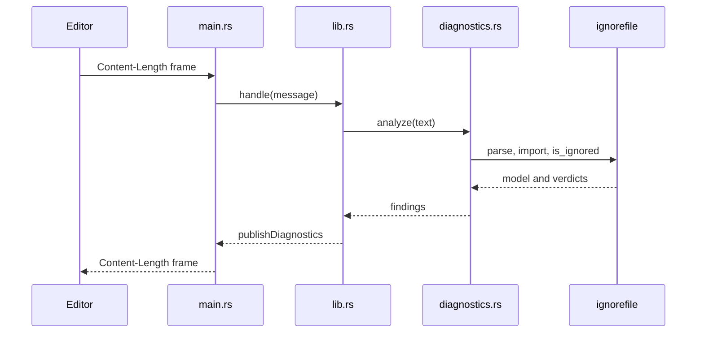
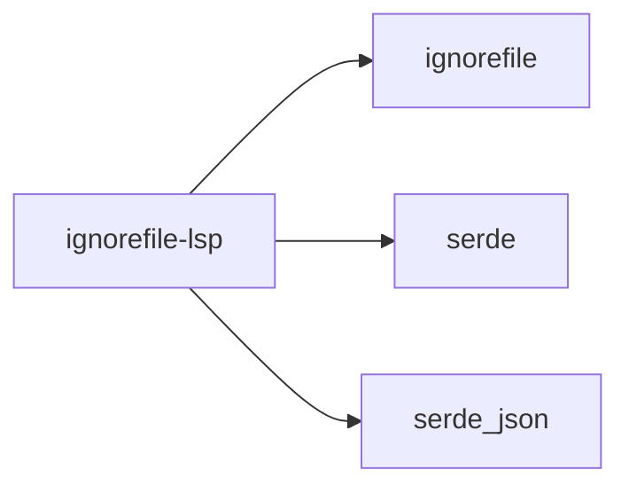

<!--
SPDX-FileCopyrightText: ignorefile contributors

SPDX-License-Identifier: MIT OR Apache-2.0
-->

# ignorefile-lsp

A Language Server for ignore files, so an editor shows problems as they are
typed.

Part of the [ignorefile workspace](../../README.md).

## Shape



Three layers, split so that only the outermost is untestable:
`diagnostics.rs` is pure analysis, `lib.rs` is pure protocol, and `main.rs` adds
the stdio loop and the `Content-Length` framing. That last file is the sole part
excluded from the coverage gate.

## Diagnostics

| Finding | Severity | Detected by |
| --- | --- | --- |
| The file cannot be kept as configuration | warning | re-rendering the import and comparing |
| A re-inclusion that can never apply | warning | the ancestor rule in the matcher |
| A duplicated pattern | hint | first-occurrence tracking |

The second is the one worth having. Given:

```gitignore
build/
!build/keep
```

git never descends into `build/`, so `!build/keep` does nothing. That is easy to
write, silent, and reported here as a warning naming the excluded directory.

## Protocol coverage

`initialize`, `shutdown`, `exit`, and `textDocument/didOpen`, `didChange`,
`didClose`. Sync is full text on every change, which costs nothing for a file
this size and removes a whole class of incremental-update bugs. Closing a
document publishes an empty diagnostic list so the editor clears its squiggles.

Malformed frames, notifications with no URI, and changes with no content are all
survived rather than fatal: staying up beats dying on one bad message.

## Running it

```sh
cargo run -p ignorefile-lsp
```

It speaks LSP on stdin and stdout. Point your editor's language client at that
command for `.gitignore` and friends.

## Dependencies



No LSP framework and no async runtime. The server is request-response over one
stream, so a runtime would have added a dependency without adding capability.
