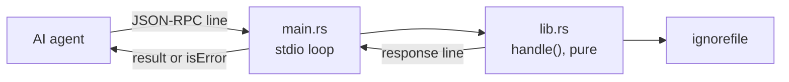
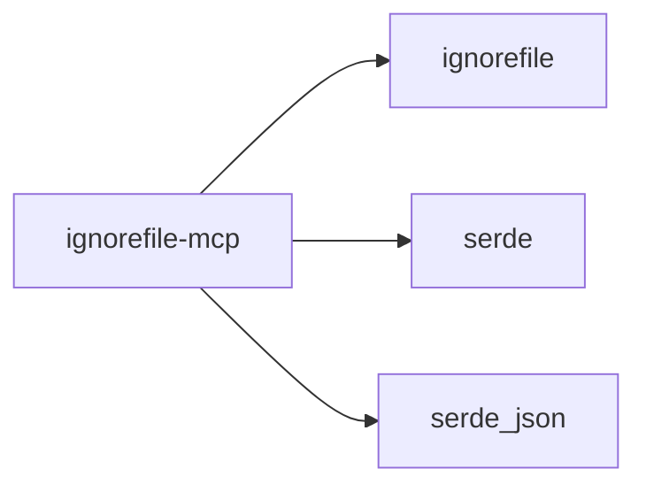

<!--
SPDX-FileCopyrightText: ignorefile contributors

SPDX-License-Identifier: MIT OR Apache-2.0
-->

# ignorefile-mcp

A Model Context Protocol server, so an AI agent can manage ignore rules through
tools rather than by editing raw text.

Part of the [ignorefile workspace](../../README.md).

## Why this exists

An agent editing a `.gitignore` as text can reorder a negation past the pattern
it overrides and silently change what git ignores. Going through the core
library instead means every change is validated and round-trip verified before
it reaches disk, so the failure mode becomes a refusal with a line number rather
than a quiet behaviour change.

## Shape



MCP is JSON-RPC 2.0. `handle` is a pure function from a request string to an
optional response string, so the whole protocol surface is testable without a
process, a socket or a client. `main.rs` adds only the line-delimited stdio
loop, which is why it is the sole part excluded from the coverage gate.

## Tools

| Tool | Arguments | Returns |
| --- | --- | --- |
| `import` | `gitignore`, `format` | configuration text, or the refusal |
| `generate` | `config`, `format` | `.gitignore` text |
| `validate` | `config`, `format` | `valid: N section(s)`, or the problem |
| `explain` | `gitignore`, `path`, `is_dir` | whether git would ignore the path |

`format` defaults to `toml`. A tool failure comes back **inside a successful
response** with `isError: true`, which is what MCP specifies: the model is meant
to read the message and try again, not see a transport error.

## Running it

```sh
cargo run -p ignorefile-mcp
```

It speaks line-delimited JSON-RPC on stdin and stdout:

```console
$ echo '{"jsonrpc":"2.0","id":1,"method":"tools/list"}' | ignorefile-mcp
{"jsonrpc":"2.0","id":1,"result":{"tools":[...]}}
```

Register it with an MCP client by pointing the client at that command.

## Protocol coverage

`initialize`, `tools/list` and `tools/call`. Notifications are answered with
silence, as the specification requires. Unknown methods, malformed JSON, a wrong
`jsonrpc` version and a call with no tool name each return the correct JSON-RPC
error code (`-32601`, `-32700`, `-32600`, `-32602`).

## Dependencies



No MCP framework and no async runtime: the protocol needed here is a request
string in and a response string out, and a dependency would have bought
indirection rather than capability.

**One thing not to assume:** `explain` answers for `.gitignore` semantics only.
Docker resolves patterns against the build context and has no equivalent of
git's rule that an excluded directory cannot have its contents re-included, so
this must not be reused for `.dockerignore` without its own oracle.
