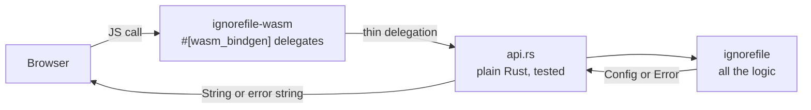
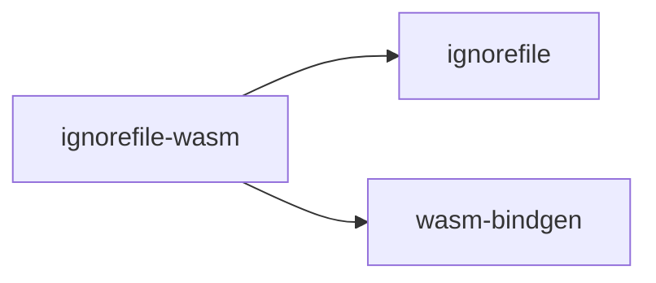

<!--
SPDX-FileCopyrightText: ignorefile contributors

SPDX-License-Identifier: MIT OR Apache-2.0
-->

# ignorefile-wasm

WebAssembly bindings, so an ignore file can be converted in the browser with
nothing installed.

Part of the [ignorefile workspace](../../README.md).

## Shape



## Exports

| Function | Does |
| --- | --- |
| `import(gitignore, format)` | `.gitignore` text to configuration text |
| `generate(config, format)` | configuration text to `.gitignore` text |
| `convert(config, from, to)` | re-encode between toml, json and yaml |
| `validate(config, format)` | check, returning the first problem |
| `isIgnored(gitignore, path, isDir)` | whether git would ignore a path |

`format` is `toml`, `json`, `yaml` or `yml`. Errors cross the boundary as
strings: JavaScript has no use for the typed variants, and the message is
already the actionable part.

```js
import init, { import as importFile, isIgnored } from "./pkg/ignorefile_wasm.js";

await init();
const config = importFile("## Logs\n*.log\n", "toml");
isIgnored("*.log\n", "app.log", false); // true
```

Build with `wasm-pack build crates/ignorefile-wasm`.

## Why the split

`src/lib.rs` holds **only** `#[wasm_bindgen]` shims, each a one-line delegate to
`api.rs`. That is what makes excluding `lib.rs` from the coverage gate honest: a
`#[wasm_bindgen]` export cannot be exercised by a native test run, so there must
be nothing in it worth exercising. `api.rs` is plain Rust over plain strings and
is measured like any other module.

The exclusion is listed once, in `tarpaulin.toml`'s `exclude-files`. It used to
be duplicated into an `IGNORE` regex in a second coverage task that had to stay
byte-identical with it; that second engine is gone, so there is one list and one
verdict.

## Dependencies



The crate builds as both `cdylib`, which `wasm-pack` turns into a `.wasm`
module, and `rlib`, which keeps `api.rs` testable on the host.
