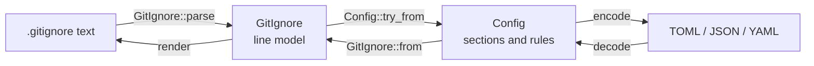
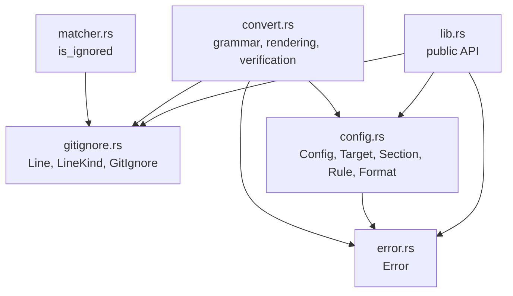
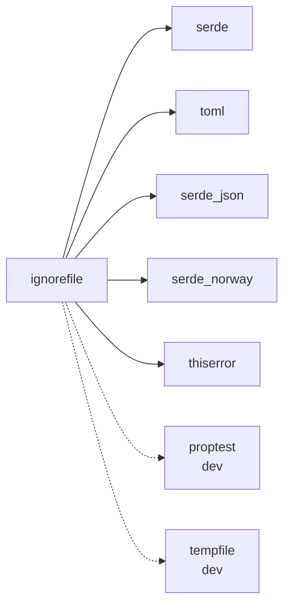

<!--
SPDX-FileCopyrightText: ignorefile contributors

SPDX-License-Identifier: MIT OR Apache-2.0
-->

# ignorefile

Core library: parse an ignore file into a structured model, render it back byte
for byte, and decide what git would ignore.

Part of the [ignorefile workspace](../../README.md).

## The invariant

Everything here rests on one property, and no later feature may weaken it:

```text
render(parse(x)) == x, byte for byte
```

An ignore file is order-dependent and anchor-sensitive, so a model that
normalizes its input changes which files git ignores. Import is therefore
lossless or it refuses.

## Pipeline



`Config::try_from` is the only fallible edge. It renders the configuration it
just built and compares it against the source; if they differ it returns
`Error::NotCanonical` naming the first differing line, rather than silently
reformatting the file.

That difference is always a formatting one. Patterns reach the configuration
verbatim and in order, so only comments and blank lines can move; a refused file
still ignores exactly the same paths. `GitIgnore::canonical` produces the form
that imports cleanly, and is what `ignorefile fmt` writes.

## Modules



Note that `convert` and `matcher` are not re-exported: they contribute trait
impls and inherent methods to types that are. The dependency arrows only ever
point toward `error` and `gitignore`, so there are no cycles.

| Module | Responsibility |
| --- | --- |
| `gitignore` | Lines kept verbatim; classification derived, never stored |
| `config` | The serialized shape, three encodings, and `validate` |
| `convert` | The `###` / `##` / `#` grammar, both directions, verified |
| `matcher` | Whether git would ignore a path |
| `error` | One error type for the crate |

## Dependencies



`serde_norway` rather than `serde_yaml`, because the latter is unmaintained and
would be reported by `cargo audit`.

## Generated output is formatter-stable

`encode` emits TOML whose key order already matches what a formatter would
produce: keys sorted alphabetically, values ahead of tables. So `Config` declares
`name` before `version`, `Section` declares `level, name, note`, and `Rule`
declares `add, ignore, note`. Field order is serialization order, and getting it
wrong means every `import` leaves a file the project's formatter immediately
rewrites.

Arrays use the compact encoder for the same reason: the pretty one wraps every
multi-element array over several lines with a four-space indent, which no
formatter agrees with.

One residual: an array longer than the formatter's column limit is still
re-wrapped, because matching that would mean reimplementing its width heuristic.
`tests/config_format.rs::emitted_toml_is_already_formatter_canonical` locks the
key order in place.

## Usage

```rust
use ignorefile::{Config, Format, GitIgnore};

let source = "## Logs\n*.log\n\n# keep this one\n!important.log\n";

// Import, which fails rather than lose information.
let parsed = GitIgnore::parse(source);
let config = Config::try_from(&parsed)?;

// Any of the three encodings, interchangeably.
let toml = config.encode(Format::Toml)?;
assert_eq!(GitIgnore::from(&Config::decode(&toml, Format::Toml)?).render(), source);

// And ask what git would do.
assert!(parsed.is_ignored("app.log", false));
assert!(!parsed.is_ignored("important.log", false));
# Ok::<(), ignorefile::Error>(())
```

## Tests

| File | What it holds in place |
| --- | --- |
| `tests/roundtrip.rs` | The byte-for-byte property, over generated files and a corpus |
| `tests/differential.rs` | The matcher agrees with `git check-ignore` |
| `tests/convert.rs` | The grammar, and every input that must be refused |
| `tests/config_format.rs` | Three encodings interchangeable, order preserved, validation |
| `tests/schema.rs` | The published JSON Schema cannot drift from these types |

`differential.rs` requires `git` on the PATH: it is the oracle, and a skipped
oracle would let the matcher rot while the suite stayed green. It already caught
one real bug, that git aborts on an unterminated `[` rather than treating it as a
literal the way POSIX `fnmatch` does.
