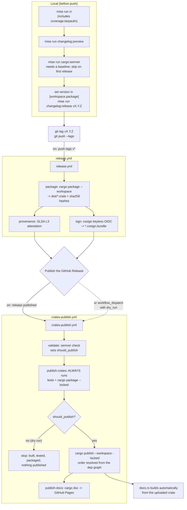

<!--
SPDX-FileCopyrightText: ignorefile contributors

SPDX-License-Identifier: MIT OR Apache-2.0
-->

# Runbook

Operating this repository: the routine loops, the release path, and what to do
when a gate goes red.

Design rationale lives in [design/config-format.md](design/config-format.md),
conventions in [../AGENTS.md](../AGENTS.md), and the plan in
[ROADMAP.md](ROADMAP.md). This file is only about running things.

Every command goes through [mise](https://mise.jdx.dev). `mise tasks` lists them
all with descriptions.

## First run on a new machine

```sh
mise run setup           # provisions the toolchain and every pinned tool
mise run git:hooks:install   # installs the hk git hooks
mise run doctor          # one row per tool, MISSING for anything absent
```

`mise` is the only prerequisite. The Rust version comes from
`rust-toolchain.toml`; everything else from `mise.toml`. Entering the directory
triggers `setup` automatically via `[hooks] enter`.

`git` is a hard requirement for the test suite, not just for version control:
`crates/ignorefile/tests/differential.rs` uses `git check-ignore` as its oracle.

## The loop while working

```sh
mise run cargo:test              # inner loop: cargo-nextest, fast and filterable
mise run cargo:test:doc          # inner loop: the doctest half nextest cannot run
mise run lint              # fmt:check + clippy, read-only
mise run coverage:tarpaulin  # THE gate: tests + doctests + coverage, one pass
mise run pr:ready          # auto-format, then run that gate
```

**There is one test gate, and it is `mise run coverage:tarpaulin`.** Tarpaulin's
`--run-types Tests --run-types Doctests` builds and runs the unit, integration
and doc tests under instrumentation, then fails under the threshold. So the tests
a gate ran and the coverage it gated on always describe the same build. The same
task backs `pr-ready`, `ci:quick`, `ci` and the Tests job in
`.github/workflows/ci.yml`; a local green and a CI green mean the same thing.

`test` and `test:doc` remain, but only as the TDD inner loop. They are fast and
they take a filter, which the gate does not; they are **not** a gate. Expect the
gate to take minutes where `test` takes seconds.

**Read the test count, not just the exit code** -- for `mise run cargo:test`.
`mise.toml` sets `NEXTEST_NO_TESTS = "warn"` so a filter matching nothing exits 0
having run nothing. `144 tests run: 144 passed` is evidence; `exit 0` alone is
not. This trap is nextest-specific and therefore inner-loop-only: the gate drives
`cargo test`, which has no silent-pass mode.

## Running each surface

```sh
cargo build --release

./target/release/ignorefile --help      # or the short alias: ign
./target/release/ignorefile-mcp         # JSON-RPC on stdin/stdout, line-delimited
./target/release/ignorefile-lsp         # LSP on stdin/stdout, Content-Length framed
```

Smoke-test the MCP server without a client:

```sh
echo '{"jsonrpc":"2.0","id":1,"method":"tools/list"}' | ./target/release/ignorefile-mcp
```

The LSP server needs `Content-Length` framing, so it is not shell-friendly;
point an editor's language client at the binary instead.

The WebAssembly module needs its own target. `mise run ci` covers it via
`mise run cargo:wasm`, which is the only thing in the gate that compiles this crate
for wasm at all -- a host build proves nothing, because wasm-bindgen's macros
expand to almost nothing off a wasm target:

```sh
mise run cargo:wasm                          # clippy + release build for wasm32
wasm-pack build crates/ignorefile-wasm # the publishable npm package
```

## Release

Nothing has been published yet, so the first release runs this end to end for the
first time. There is no `publish` task; the ordering below is the part that is
easy to get wrong.

### What runs where

Three workflows react to a release, and they are triggered by two different
events. Getting that wrong is the usual cause of "why did nothing publish":
`release.yml` fires on the **tag push**, while `crates-publish.yml` fires on the
**GitHub Release being published**, which is a separate act.



Two properties of that graph are worth stating outright, because both were once
false:

- **`publish-crates` runs on a dry run.** It is gated on `should_publish` at the
  publishing *step*, not at the job. Gating the job was what made `dry_run` a
  no-op: the job was skipped, so the packaging it was supposed to rehearse never
  happened.
- **The test gate runs inside the publish workflow.** A release can be cut from
  any tag, so there is no guarantee `ci.yml` was ever green on that commit, and a
  crates.io version number cannot be reclaimed once spent.

### Step by step

1. Green gate, from a clean tree.

   ```sh
   mise run ci
   hk run check --all
   ```

2. Preview the changelog and check nothing surprising landed.

   ```sh
   mise run changelog:preview      # unreleased entries only
   ```

3. Check for accidental breaking changes.

   ```sh
   mise run cargo:semver
   ```

   **Before the first publish this fails**, and the failure is expected:
   `cargo-semver-checks` needs a baseline to compare against and reports
   `ignorefile not found in registry (crates.io)`. Skip the step for the first
   release, or give it a git baseline instead:

   ```sh
   cargo semver-checks --baseline-rev <tag-or-sha>
   ```

4. Set the version. It lives once, in `[workspace.package]` of the root
   `Cargo.toml`; every crate inherits it. Then write the changelog:

   ```sh
   mise run changelog:release v0.2.0
   ```

5. Publish. The satellites all depend on the core crate by both path and
   version, so crates.io rejects them until it exists -- but `--workspace`
   resolves that order from the dependency graph itself and waits on the index
   between crates, so there is no manual sequencing to get wrong:

   ```sh
   cargo publish --workspace
   ```

   This is what `.github/workflows/crates-publish.yml` runs, so a release cut
   from a GitHub release needs no local publish at all. Add `--dry-run` to
   rehearse it; the workflow exposes the same thing as its `dry_run` input, and
   that input now genuinely builds, tests and packages every crate.

6. Tag and push the tag once the publish succeeds, not before.

**Packaging is crate-relative.** `readme = "README.md"` and the licence files are
resolved under the package root, and `cargo package` includes nothing above it.
Each crate therefore carries its own `LICENSE-MIT` and `LICENSE-APACHE` symlinks
into the shared `LICENSES/` texts -- cargo dereferences them and ships the real
content, so the licences stay single-sourced while every published archive is
self-contained. Confirm with:

```sh
cargo package -p ignorefile --list | grep -E 'README|LICENSE'
```

## When a gate goes red

### `mise run cargo:test` fails with "no tests to run"

A filter matched nothing. Not a regression. Check the filter spelling.

### Coverage is below 100%

The threshold is 100%. `mise run coverage:tarpaulin` prints the uncovered lines
per file directly, so start by reading its output; for a browsable view of the
same run:

```sh
mise run coverage:open     # HTML report, opens in the browser
```

Exclusions live in exactly one place, `tarpaulin.toml`'s `exclude-files`. Do not
add a second list anywhere.

A gap on a line that has no uncovered *statement* means a **branch**. In this
codebase that is almost always one of four things, in rough order of frequency:

1. A genuinely missing test. Check this first; most of them are.
2. An unreachable `?` error arm. `?` desugars to a match whose error arm is a
   region in your file; if the call cannot fail for your types, that region can
   never be covered. Use `map_err`/`and_then`, which keep the branch in core.
3. An `assert!` format argument, which is only evaluated on failure. Bind it to a
   variable first.
4. A `serde_json::to_string` over a struct that cannot fail. Build a
   `serde_json::Value` and call `to_string()`, which is infallible.

Never widen `exclude-files` or lower `RUST_COVERAGE_THRESHOLD` to make it pass.
If a gate is genuinely wrong, say so and stop.

### Coverage reports functions as unreached that the tests plainly reach

Stale profile data from an earlier build being merged into this one. Clear it:

```sh
mise run clean:cov && mise run coverage:tarpaulin
```

### `coverage:tarpaulin` fails with "Failed to compile tests" or a missing `.rmeta`

Two cargo processes are sharing `target/`. Tarpaulin rebuilds the workspace with
instrumentation, so a concurrent `mise run cargo:test`, a rust-analyzer check, or a
second coverage run will clobber each other's fingerprints. The error names a
dependency that has nothing to do with your change (`bumpalo`, `zerocopy`).
Let the other build finish and re-run; nothing is actually broken.

### clippy fails on a lint that looks wrong

Two have come up and are documented in the code rather than suppressed globally:

- `trivially_copy_pass_by_ref` on serde's `skip_serializing_if`. Serde requires
  `fn(&T) -> bool`, so the lint is structurally inapplicable. Suppressed at that
  one function with a comment.
- `allow-expect-in-tests` does **not** cover helper functions in an
  integration-test crate. Use `let ... else { panic!() }` or `assert!`.

### `hk run check --all` fails on a generated file

`ignorefile.toml` is emitted formatter-canonical: keys alphabetical, values
before tables, arrays inline. If `taplo` rewrites it, either the emitted field
order regressed, in which case
`tests/config_format.rs::emitted_toml_is_already_formatter_canonical` should have
caught it, or an array exceeded the 80-column limit, which is a known and
accepted residual.

### `hk run pre-commit` behaves oddly on a repository with no commits

`hk.pkl` sets `stash = "git"`, and `git stash` cannot run before the first
commit. Use `hk run check --all`, which is read-only and does not stash.

### `mise run cargo:audit` reports an advisory

`.cargo/audit.toml` sets `severity_threshold = "medium"`. Fix or justify; do not
raise the threshold. Note `serde_yaml` is deliberately not used because it is
unmaintained; `serde_norway` is the maintained fork.

## Known gaps

These fail by design, because the thing they need does not exist yet. Do not
treat them as regressions.

| Command | Why it fails |
| --- | --- |
| `mise run act` | needs a running Docker daemon |
| `mise run gh:branch:protect` | no GitHub remote configured |
| `mise run codecov` | needs `CODECOV_TOKEN` and the repo activated |
| `mise run fuzz` | no `crates/ignorefile-fuzz` yet |
| `mise run bench` | no benchmarks yet |
| `mise run cargo:vet` | non-blocking by design; swallows its own failure |
| `mise run cargo:semver` | no published baseline yet; needs `--baseline-rev` |

`mise run ci` mirrors every job in `.github/workflows/ci.yml`, so a green local
run is good evidence CI will be green too. The exceptions are the jobs that need
GitHub itself: secrets scanning, CodeQL, SLSA provenance and Scorecard.

## Things an agent must not do

From [guidelines/CONTRIBUTION.md](guidelines/CONTRIBUTION.md), and
non-negotiable: do not commit or push without explicit per-action human
approval, do not open pull requests, and do not write pull-request descriptions,
commit messages or reviewer replies. If asked to commit on a human's behalf, use
`Assisted-by:`, never `Co-authored-by:`.
